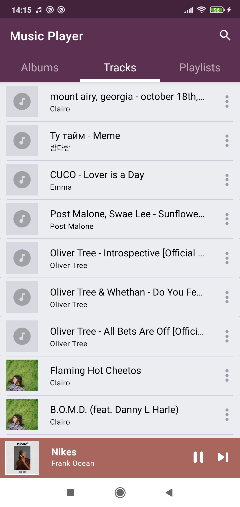

# MusicPlayer

MusicPlayer lets you listen the music on your phone and organize it into playlists.

# Features

Features include:

- Browsing songs and albums
- Creating and managing playlists
- Playback controls
- Search songs

# Screenshots

The design is inspired by the Google Play Music app.

# Preview

# Development Environment

The app is written entirely in Java and uses the Gradle build system.

To build the app, use the gradlew build command or use "Import Project" in Android Studio.

# Libraries/Design patterns used

- [AndroidX][3]
- MVP architecture
- [Glide][1] - for loading images
- [MotionLayout][2] - for implementing sliding up panel with playback controls

[1]: https://bumptech.github.io/glide/
[2]: https://developer.android.com/training/constraint-layout/motionlayout
[3]: https://developer.android.com/jetpack/androidx

